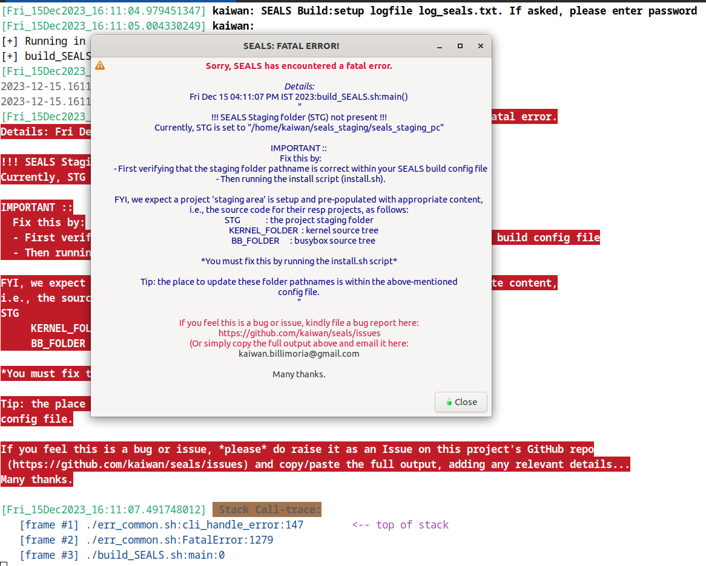
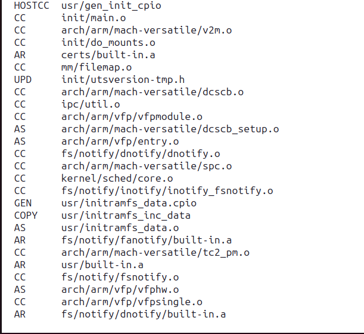

SEALS
=====
SEALS is an abbreviation for _Simple Embedded ARM Linux System_.
It uses the powerful and FOSS *Qemu* (quick emulator!) to emulate a few target boards, helping us learn how to build a small (skeletal, really) embedded Linux system pretty muc from scratch!

**NEW! (Oct 2023) : SEALS now supports:** 
- A simple GUI at startup to select the target machine to deploy 
- New machines (platforms)! 
    - the good 'ol PC (x86_64 or amd64)     [Dec 2023] 
    - the Raspberry Pi 3B (shows as the Compute Model 3 - CM3)

(Jan 2023): SEALS now supports both AArch32 and AArch64 platforms

The SEALS project consists of scripts that will enable you to build a simple
yet complete skeletal ARM\*/Linux system, emulated using the powerful [QEMU][2]
emulator. The SEALS scripts automate the following tasks:

- Using a simple ASCII text config file to precisely customize your environment
- Using a cross-compiler
- ARM\* / Linux kernel config and build
- Creating a skeletal root filesystem from scratch
- Integrating the components together, using QEMU (qemu-system-arm,
  particularly) to run the same in an emulated environment.

\*ARM can now be AArch32 or AArch64 platforms.  
From v0.3, SEALS also supports the x86_64 / amd64 PC platform (so it isn't strictly only 'ARM' now!)

# Getting Started
Please, FIRST READ 
    - [the SEALS Getting Going! Tutorial](https://github.com/kaiwan/seals#a-very-brief-tutorial-on-getting-going-with-seals)  

Then, in the Wiki section, the: 
    - [SEAL's Wiki page - intro to SEALS][0], and  
    - [SEAL's HOWTO page][1]  
to better understand how to build and use this project.

*SEALS can prove very useful for developers / testers to prototype, try things out in a custom ARM/\*Linux or emulated x86 PC simple guest system.*

## Install
- Clone this repository: 
`git clone https://github.com/kaiwan/seals.git`
- Run the `run_and_log` script.

# A very brief tutorial on getting going with SEALS

I assume you're running in GUI mode (via Xorg or Xwayland).

 *Step 1.* Perform the git clone (as mentioned above) 

 *Step 2.* If you immediately run the `run_and_log` script, it typically results in an error, saying that the "staging, busybox and kernel source folders" aren't present.
This is typically the case when you start out.
 

***FAQ: Where are the staging and other folders designated?***  
In the all-important **build config** file!  
This file is, by default, named `build.config` and is a symbolic (or soft) link to the `build.config.arm32_vexpress` build config file - to build and run the (emulated) ARM-32 Verstaile Express board!

    $ ls -l build.config
    lrwxrwxrwx. 1 kaiwan kaiwan 18 Dec 14 15:43 build.config -> build.config.arm32_vexpress

*It's very important to familiarize yourself with the board config files! Please browse through them, they're quite self-explanatory (with a lot of comments).*

Here's a snippet from the `build.config.arm32_vexpress` file showing how these folders are designated:

    STG=~/seals_staging/seals_staging_arm32
    ROOTFS=${STG}/rootfs
    IMAGES_FOLDER=${STG}/images
    IMAGES_BKP_FOLDER=${STG}/images_bkp
    CONFIGS_FOLDER=${STG}/configs

You're free to edit it... typically, just set the `STG` variable  to point to your staging location on your build host's disk, the rest follow under it... (In a similar fashion, the board config files use simple shell variables to designate various board attributes, the root fs and kernel stuff, and more; you must browse through them.

So, back to the setup. To fix possible errors the first time you run SEALS, install the busybox and kernel folders and their source trees **by running the `install.sh` script**; here's a screenshot:

(The script detects and deletes old source if required).
When it's done, you should have the Linux busybox project and the Linux kernel source tree installed.
 

You can change the target board of course... by either manually updating the soft link, or, better, via our GUI! These are the 'prebuilt' target board config files we provide: 

    $ ls build.config*
    build.config@  build.config.amd64  build.config.arm32_vexpress  build.config.arm64_qemuvirt  build.config.arm64_rpi3b_cm3

The one that the `build.config` soft link points to is the current one, the one that will get built and run (via Qemu). You can even define your own board config files using these as a template! (of course, introducing new variables will require your editing the `build_SEALS.sh` script as well). When you do do this and it works, consider contributing it!

 

 *Step 3.* Run the `run_and_log` script. 
Now, *if you do NOT* have the staging, busybox and kernel source folders installed (*Step 2*), you'll get the following (or similar) error message (notice how it's both via the GUI and on the console (terminal window)):

(Hey, this is expected! Read it carefully; the project expects you to minimally setup a 'staging area' or work area (where the stuff gtes built at runtime) like this: 

<staging-dir\>  
   |--- linux-kernel-source-tree  
   |--- busybox-git-source-tree

).

Assuming these folders and the sources are in place (typically achived by running the `install.sh` script), all will be well and execution continues...
The `build_SEALS.sh` script is the primary script (invoked by the `run_and_log` script) and the first thing it does is show you the currently selected target platform, and allows you to change it via this gui:

(TODO: A slight issue: when you select another board, the highlight bar still stays on the first one, but that's okay).

To go ahead with the current selection, simply press `Esc` here... Else, select another board by turning on it's radio button and thenclick on `Select`; a confirmation dialog pops up.
(TODO: the new target board selection procedure's only via the GUI currently; need to update the console mode for it as well).

  *Step 4.* You are now shown the currently selected target board configuration in detail (both via a gui dialog box and on the console):

The config details are picked up from the `board.config.<foo>` file pertaining to the current board. 
This dialog allows you to review the current settings for it and decide if the current board config is fine; if your answer is:

  * Yes, it's fine: simply click the `Yes` button
  * No, I need to edit it: click the `No` button, and the script aborts. Edit the relevant `build.config.<foo>` file to your satisfaction, and then rerun the script.

*Step 5.* When happy with the state of the build config file, run the script:

After the 'usual' GUI dialogs, (the ones you've seen in the earlier steps), you will get the main menu GUI dialog:

Read the (blue color) notes on top carefully. Go ahead and select whichever options you'd like SEALS to perform! Click on `OK` when done. 

Here's an example showing some selections made:

***FAQ> What do the `Wipe kernel / busybox config (Careful!*)` options do?*** 
Ans> Essentially, they have the underlying kbuild menu system to run it's `make ARCH=<whatever> defconfig` thus setting all config values to their default. So, it's typically useful to do this the first time you're performing the build. Once you've saved your won config, you can disable these toggles, thereby keeping your config (also, FYI, the config files, among others, can be saved / backed up (the second-to-last option). 
If running in console (non-gui, on a terminal window) mode, it still works and will interactively ask you to select what you want it to do.

Perhaps it still generates errors. This could be due to missing packages (we only automate installation of required host packages on Ubuntu). More likely, the absence of the **cross toolchain** - specified in the board config file - is the issue (see the FAQ below).

***FAQ> I'm getting errors regarding the toolchain***  
Ans> The (cross) toolchain is a required component when using any of the ARM-based boards.
You'll have to install it on your build host (which can be a Linux VM, np). [The detailed documentation to do so is in the Wiki section](https://github.com/kaiwan/seals/wiki/SEALs-HOWTO).

#Example screenshots
All are wrt the default build config platform, the ARM-32 Versatile Express:
(FYI, all carried out in an x86_64 Ubuntu 23.04 VirtualBox guest).

**Kernel Build Portion**:-

  * A screenshot showing a portion of the kernel build step, just before entering the kernel config:

  * A screenshot showing a portion of the kernel build step, the kernel config:
 

  * Some sample output while the kernel build just begins:

  * Some sample output while the kernel is building:
 

  * Some sample output after the kernel build is done:
 

**Busybox (generates part of the target root fs: /bin, /sbin, /usr) config**:-

  * Some sample output of the Busybox config menu:
 

  * Some sample output of the Busybox completion:
 

  * Some sample output of the Busybox step, *root filesystem generation* by SEALS:
 

**Sample output from the 'Generate Root Filesystem EXT4 image' menu** :

 

** Running it!** 

  * Some sample output just prior to running the AArch32 Vexpress target board under Qemu (notice the complete Qemu command line!):
 

  * Some sample output when running the AArch32 Vexpress target board under Qemu (notice the kernel startup, all the kernel printk's being emitted as it boots...) :
 

  * Some sample output running the AArch32 Vexpress target board under Qemu; once we reach our Busybox shell via (busybox) init :
 

  * Some sample output running the AArch32 Vexpress target board under Qemu; on the Busybox shell :
 

Excellent; we're running the ARM-32 Vexpress platform.

***FAQ: Can I clean up everything (for the current board)?***

Yes! You can do so via the `cleanall` script; but **be CAREFUL**; it will ask for confimation and then delete stuff (via the typical `make clean` type of command for the source, and via `rm -rf ...` for the root fs, images, etc).

# Issues, Contribution
This project, like most FOSS ones, is ever-evolving... I urge you to not hesitate, to write in your comments, suggestions or anything.
Please do raise issues or bugs in the [Issues section of the GitHub repo](https://github.com/kaiwan/seals/issues).
Any contributions would be awesome (have a look at the current `Issues`)! I solicit your participation and help to make this project better!

[0]: https://github.com/kaiwan/seals/wiki 
[1]: https://github.com/kaiwan/seals/wiki/SEALs-HOWTO "SEALS HOWTO Page"
[2]: https://www.qemu.org/ "QEMU Homepage"
